# mylogin Local Plugin
Το συγκεκριμένο plugin κάνει override το standart login plugin του moodle.

Εγκατάσταση :
Στον φάκελο local τρέχω την εντολή 

git clone https://github.com/PanosDoris/mylogin.git mylogin

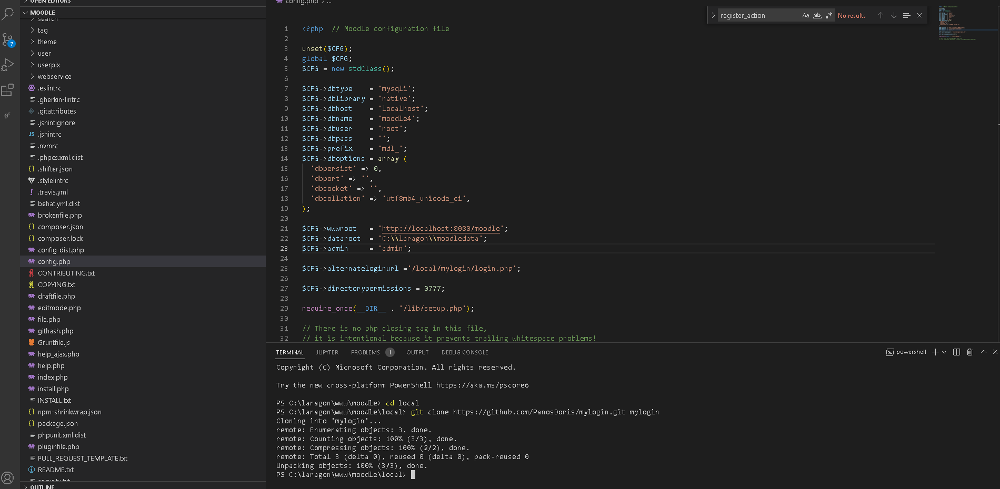

To moodle στη συνέχεια θα το εγκαταστήσει ως local plugin

Έπειτα

Βήμα 1:
Το moodle για να επιλέξει το mylogin απο το default δικό του login θα πρέπει να προστεθεί 
στο config.php η εντολή

$CFG->alternateloginurl ='/local/mylogin/login.php';

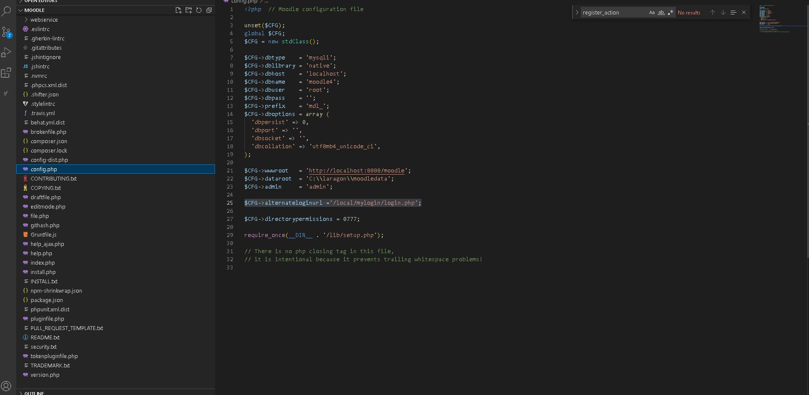

Βήμα 2:
Στο Site administration/Plugins/Manage Authentication θα πρέπει να είναι 
ενεργοποιημένο το  Email-based self-registration
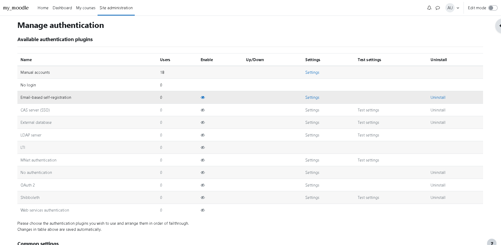

Βήμα 3:
Στα common setting του Manage Authentication
θα πρέπει : 
1 -> Η επιλογή self registration να μην είναι disable αλλά να έχει επιλεχθεί η επιλογή email-based self-registration
2 -> Η επιλογή Allow log in via email θα πρέπει να είναι checked
(optional) 3 -> Στην περίπτωση που δεν καταχωρήσετε στο config.php την εντολή στο Βήμα 1, 
τότε στην επιλογή Alternate Login Url θα πρέπει να βάλετε το path του custom login το οπόιο είναι /local/mylogin/login.php

Τέλος επιλέγουμε save.

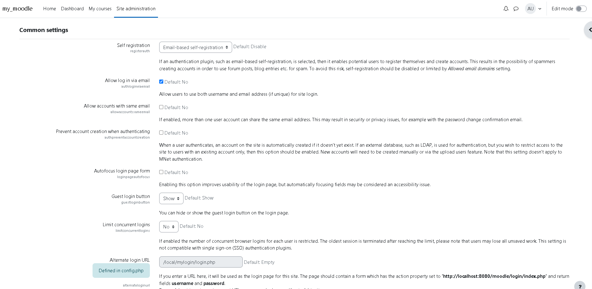

Χρησιμοποιώ το auth.php απο το auth/email στο plugin μου για την διαδικασία εισαγωγής νέου χρήστη με confirmation.
Απο την auth.php χρειάζομαι την μέθοδο user_signup.

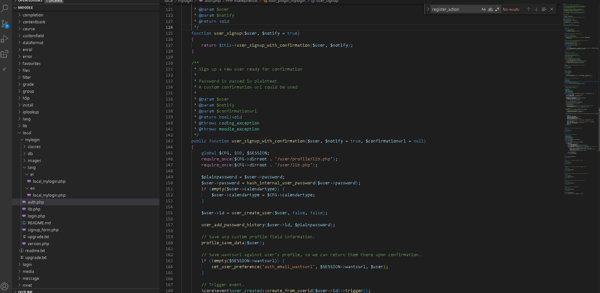

Στο αρχείο signup_form.php δημιουργώ ένα αντικείμενο της κλάσης που υπάρχει στην auth.php για να εκμεταλευτώ την λειτουργία της signup()

To plugin αρχίζει στo αρχείο login.php όπου με το html:writer έχει δημουργηθεί ένα απλό interface , μέσα απο το οποίο καλέιται η display_login_form()
απο το αρχείο lib.php για να μας την εμφανίσει.

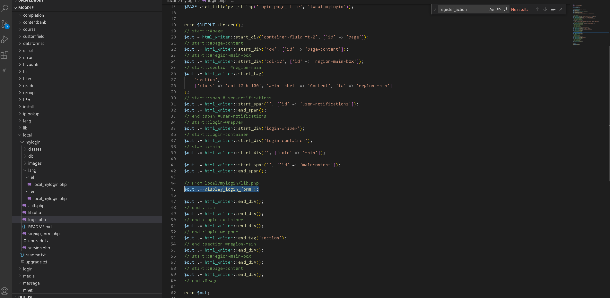

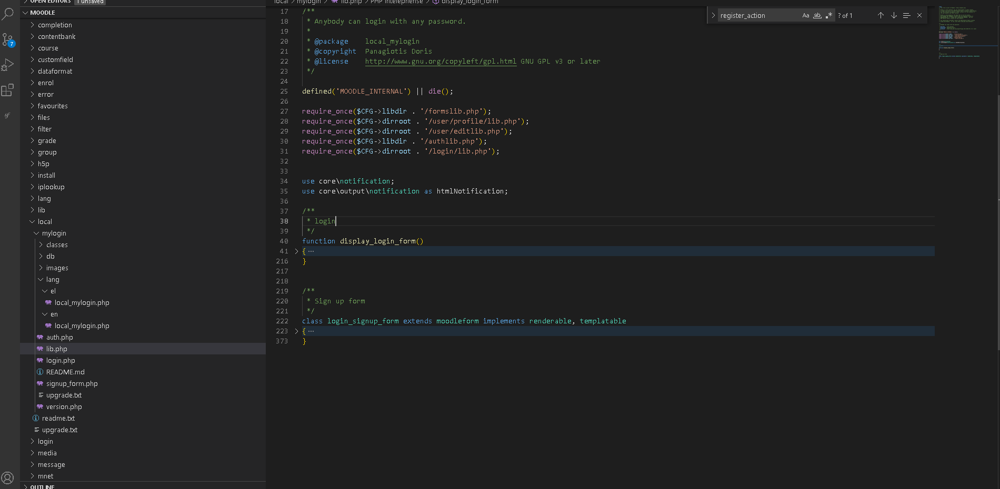

Η ίδια λογική και για την signup form στην οποία έχει προστεθεί και το πεδίο phone

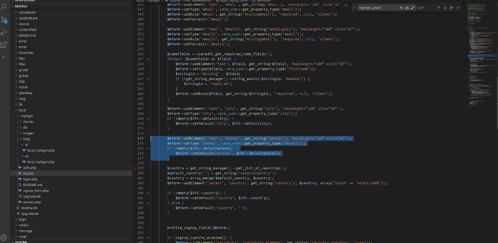

Το plugin από την ματιά του χρήστη
login page ->new account creation

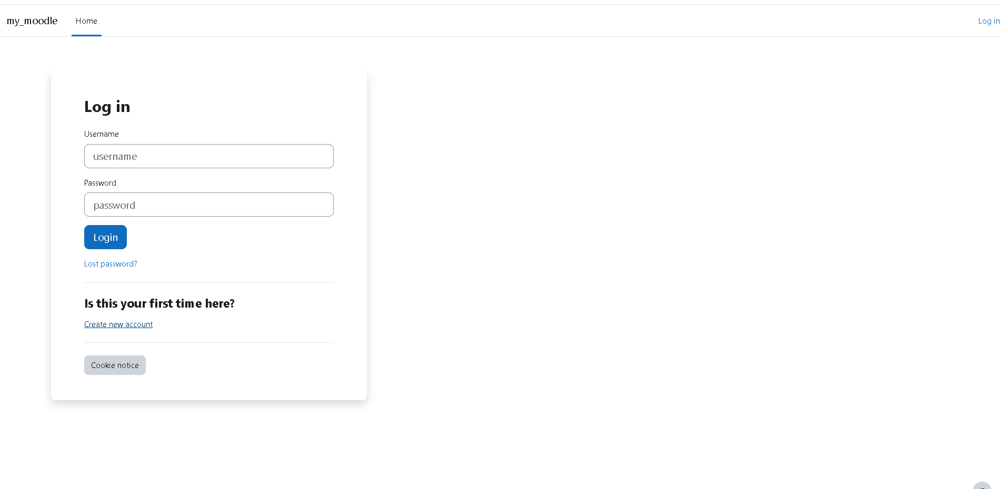

Registration Form

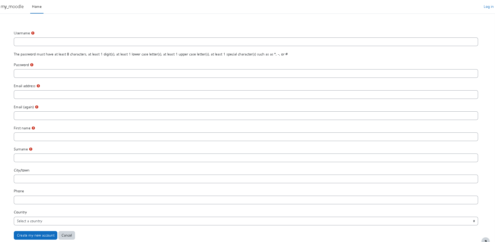

Εισαγωγή στοχείων χρήστη και submit

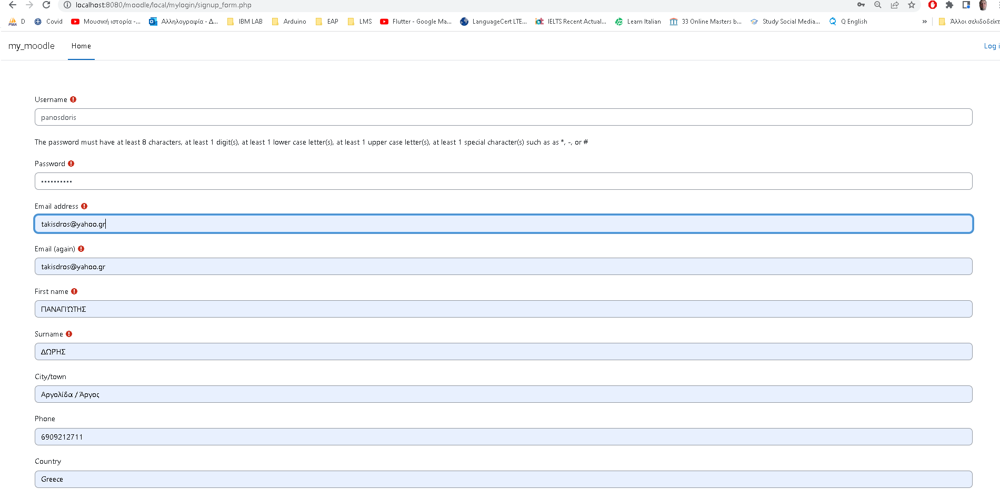

Ενημέρωση του χρήστη για επιτυχής registration και για το confirmation email που πρέπει να σταλεί απο το auth.php

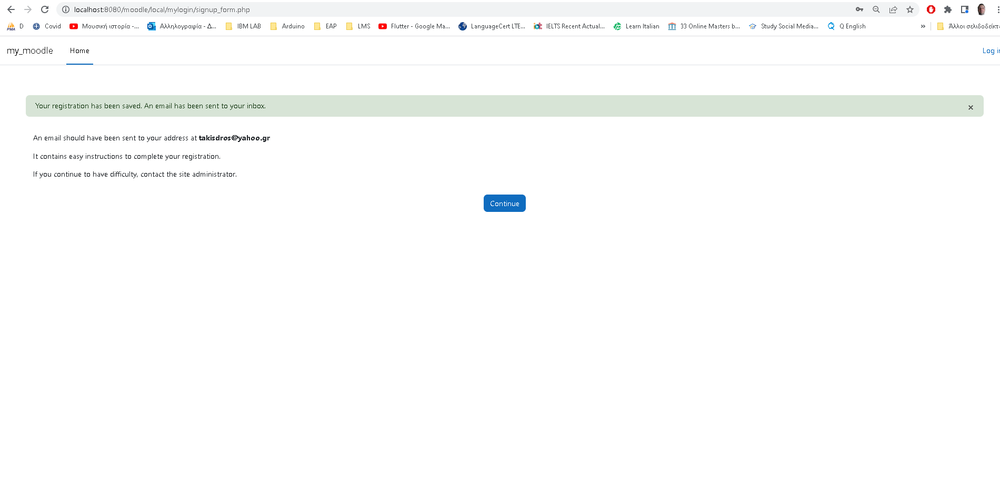

Ο χρήστης αποθηκεύεται στον πίνακα mdl_user χωρίς confirmation

Όταν ο χρήστης κάνει confirmation απο το email του τότε τα πεδία 'confirmed' και 'mnethostid' στον mdl_user θα γίνουν 1 και ο χρήστης θα μπορεί
να κάνει login στο profil του.
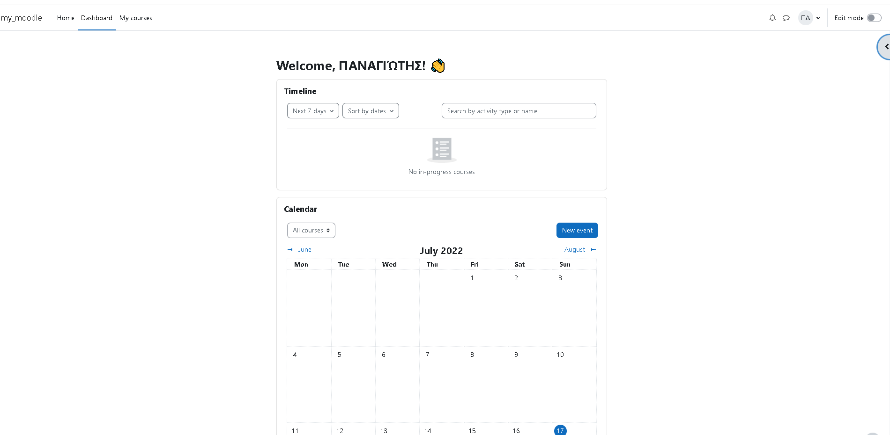

